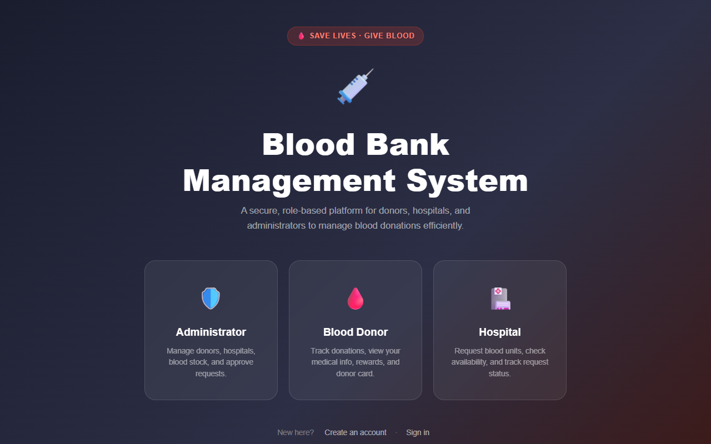

<div align="center">

# 🩸 Blood Bank Management System


A full-stack, modular Blood Bank Management System with Role-Based Login, Donor Medical Management, Donor Card Generation, and a Donor Reward System.

</div>

---

## 🌐 Live Demo
Check out the live deployed application here: **[Live Demo on Vercel](https://boodlinkdemo.vercel.app/)**



## 📸 Features Overview

| Role     | Features |
|----------|----------|
| **Admin**    | View all donors/hospitals, approve blood requests, manage stock, generate reports |
| **Donor**    | Manage profile & medical details, view donation history, download donor card, track reward points |
| **Hospital** | Request blood units, track request status, view available stock |

---

## 🛠 Tech Stack

- **Frontend**: HTML5, CSS3, JavaScript (Vanilla)
- **Backend**: Node.js + Express.js
- **Database**: Firebase Firestore
- **Auth**: Firebase Authentication
- **Security**: Firebase Admin SDK

---

## 📁 Project Structure

```text
BOODLINk-antro/
├── index.html              # Landing / Role Selection
├── pages/                  # Application Views
│   ├── login.html          # Unified login page
│   ├── register.html       # Registration page
│   ├── admin-dashboard.html
│   ├── donor-dashboard.html
│   └── hospital-dashboard.html
├── css/                    # Global Stylesheets
├── js/                     # Frontend Logic
│   ├── firebase-init.js    # Firebase config & init
│   ├── auth.js             # Auth logic
│   ├── admin.js            # Admin dashboard logic
│   ├── donor.js            # Donor dashboard logic
│   └── hospital.js         # Hospital dashboard logic
├── backend/                # Node.js Server
│   ├── server.js           # Express entry point
│   ├── routes/             # API Routes
│   ├── middleware/         # Security & Auth Tokens
│   ├── controllers/        # Business Logic
│   └── package.json        
├── firebase-config/        # Database Rules & Indexes
├── download/               # Exported assets
├── env.example             # Environment Variables Template
└── README.md               # Project Documentation
```

---

## 🚀 Installation & Setup

### Prerequisites
- Node.js v18+
- npm v8+
- A Google Firebase account

### Step 1: Clone the Repository
```bash
git clone https://github.com/dharani2006lakshmi-sys/BOODLINk-antro.git
cd BOODLINk-antro
```

### Step 2: Firebase Setup

1. Go to [Firebase Console](https://console.firebase.google.com/)
2. Create a new project (e.g., `blood-bank-system`)
3. Enable **Authentication** → Sign-in method → **Email/Password**
4. Enable **Firestore Database** → Start in **production mode**
5. Go to **Project Settings** → **Your apps** → Add a **Web app**
6. Copy the Firebase config object

### Step 3: Configure Firebase Frontend

Open `js/firebase-init.js` and replace the config:

```javascript
const firebaseConfig = {
  apiKey: "YOUR_API_KEY",
  authDomain: "YOUR_PROJECT.firebaseapp.com",
  projectId: "YOUR_PROJECT_ID",
  storageBucket: "YOUR_PROJECT.appspot.com",
  messagingSenderId: "YOUR_SENDER_ID",
  appId: "YOUR_APP_ID"
};
```

### Step 4: Backend Setup
```bash
cd backend
npm install
cp ../env.example .env
# Open .env and fill in your Firebase service account credentials
node server.js
```

### Step 5: Run Frontend
Simply open `index.html` in your browser, or use Live Server (VS Code extension) to launch the frontend!

---

## 🔐 Firebase Firestore Collections

| Collection       | Description |
|-----------------|-------------|
| `users`          | All user profiles (role, name, email) |
| `donors`         | Donor medical details & eligibility |
| `donations`      | Individual donation records |
| `bloodStock`     | Blood units by group |
| `hospitalRequests` | Blood requests from hospitals |
| `rewards`        | Points & category per donor |

---

## 📄 License

MIT License — Free to use and modify.
